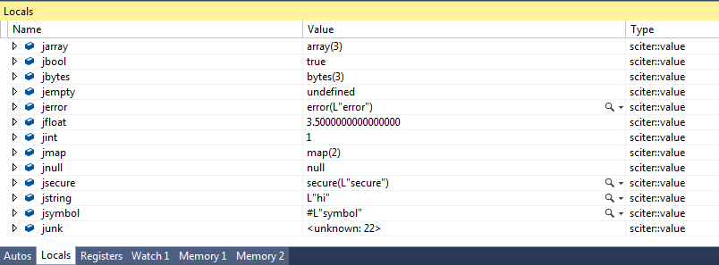

## terrainformatica sciter::value (formerly known as json::value)

Supported the following [sciter::value](http://terrainformatica.com/forums/topic.php?id=670) types:

* undefined
* null
* bool
* int
* double
* currency, date - displayed just as int
* color - displayed as hexadecimal int
* duration, angle
* string (including #symbols)
* bytes (as byte array)
* array
* map — requires a `json_value_pair` type placed in binary


Not supported (yet):

* length (int or float union?)
* function
* object
* dom_object


Note: `map` visualizer requires the following type knowledge:

```cpp
typedef std::pair<sciter::value, sciter::value> json_value_pair;

extern json_value_pair __visualize_json_value_pair = {};
```

Last line to ensure that compiler will not remove it from binary.

## Notes:

**VS 2012** and higher: download VSIX from [releases](https://github.com/pravic/json-value-visualizer/releases) page.

**VS 2010**: read [how to enable](http://stackoverflow.com/a/21008426/736762) autoexp.dat.

**VS 2005-2008**: use [autoexp.dat](autoexp.dat.txt).


## Requires:

Sciter 3.1 or higher. For lower versions use [htmlayout](https://github.com/pravic/json-value-visualizer/tree/htmlayout) branch.


### Screenshot:


